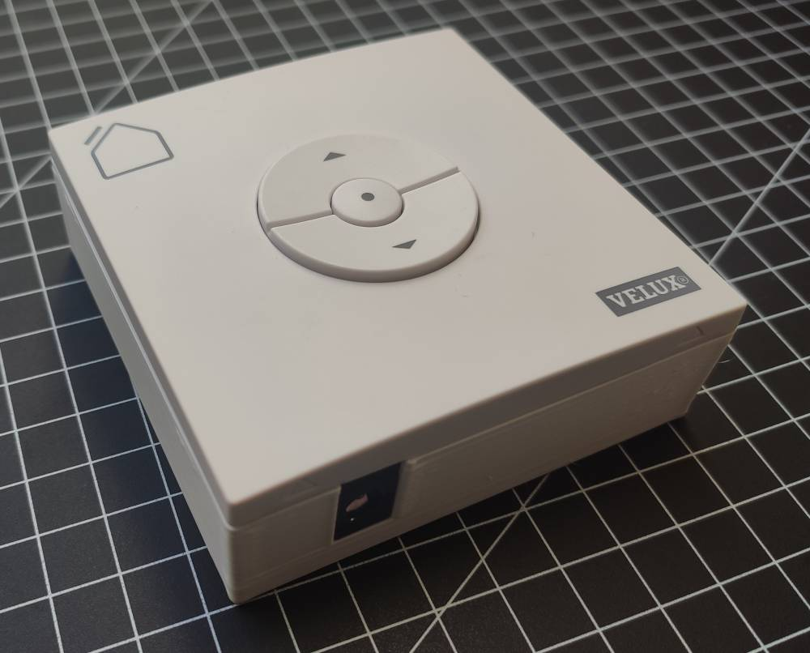

# ESPHome Velux Controller

This project modifies a Velux KLI 310 or similar remote control to integrate with home assistant.
It replaces the back panel of the original remote, powers it from the wall, and can report state back to home assistant even if you press the physical buttons.

Installing it on the remote only requires removing the back and batteries, soldering 5 wires and plugging it into the control board. This process is nondestructive and reversible.

It runs on anywhere between 5V and 12V, though 5V is preferred.

## Bill of Materials

- 1x ESP-12F module
- 1x SOT223 AMS1117-3.3 linear voltage regulator
- 3x SOT23 MMBT3904 transistor
- 8x 0603 10kΩ resistor
- 6x 0603 1kΩ resistor
- 2x 0805 100nF ceramic capacitor
- 1x SMA 22μF tantalum capacitor
- 2x PTS820 tactile switch ([DigiKey][pts820-digi], [AliExpress][pts820-ali])
- 1x DC-005 jack ([DigiKey][dc-digi], [AliExpress][dc-ali])
- 1x male pin header 1x4 2.54mm pitch
- 1x 2Pin JST-XH connector pair, right angle
- 1x 3Pin JST-XH connector pair, right angle
- spare wire + JST-XH crimps
- 4x M2x6mm coarse thread screws
- 4x M2 paper washers

[pts820-digi]: https://www.digikey.de/en/products/detail/cit-relay-and-switch/CS1213BGF160/16607902
[pts820-ali]: https://www.aliexpress.com/item/1005004307665595.html
[dc-digi]: https://www.digikey.de/en/products/detail/tensility-international-corp/54-00166/10459294
[dc-ali]: https://www.aliexpress.com/item/4001206395694.html

I didn't need these, but you can add them if your ESP is unhappy with the supply voltage:

- 1x 470μF electrolytic capacitor
- 1x 10μF electrolytic capacitor

## Attribution
Thanks to these fine people for their research on how to interface with the remote control:
- https://ottelo.jimdofree.com/velux-integra-esp8266/
- https://www.reddit.com/r/homeassistant/comments/pzhkia/hack_velux_kli3xx_to_use_blinds_without_gateway/
